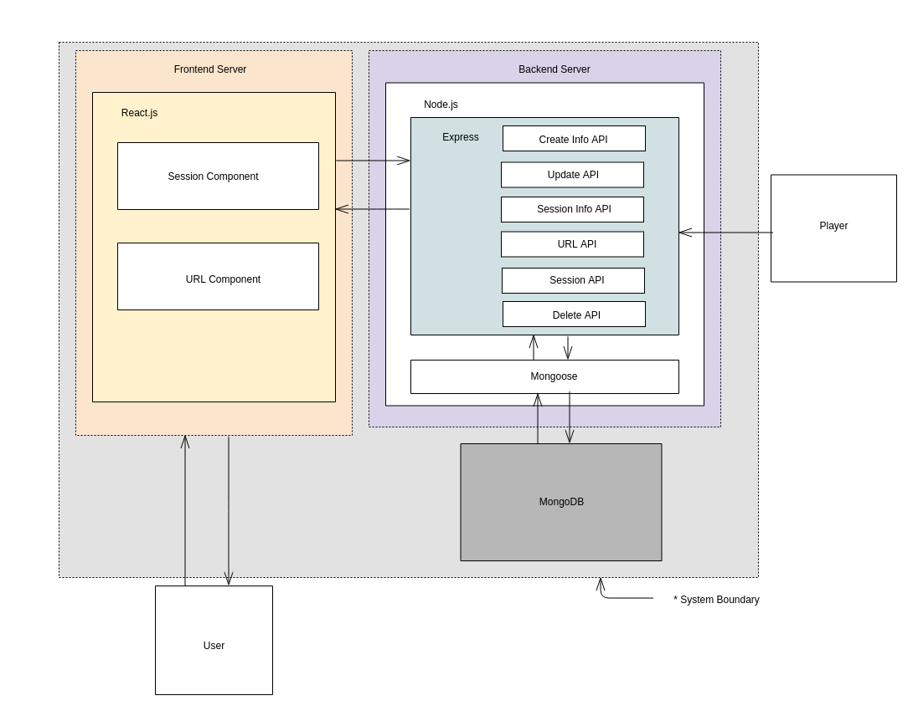

# Adaptive Streaming Player의 시청 품질 프로파일링 서비스 요구사항 명세서

## 1. 문서 설명(Document Description)

### 1.1. 목적(Purpose)
본 문서의 목적은 자사 Adaptive Streaming Player가 제공하는 시청 품질을 정량적인 평가를 통해 현 수준의 품질/성능을 측정하여, 신규 webOS TV 플랫폼 개발 시마다 품질/성능 관리를 가능하게 하는 Adaptive Streaming Player의 시청 품질 프로파일링 서비스에 대한 요구사항을 기술하는 것이다.

### 1.2. 범위(Scope)
본 문서의 범위는 제약사항(Constraints), 기능 요구사항(Functional Requirements), 품질 요구사항(Quality Attribute)이며, 이를 설명하기 위해 필요한 시스템 컨텍스트(System context)와 용어에 대한 정의를 포함한다.

### 1.3. 용어 및 정의(Terminologies and Definitions)
- Adaptive (Bitrate) Streaming : 소스 콘텐츠가 여러 비트레이트로 인코딩되는, HTTP 경유 비디오 스트리밍 방식의 하나이다.
- Node.JS : 구글 크롬의 자바스크립트 엔진(V8 Engine)에 기반해 만들어진 서버 사이드 플랫폼으로 확장성이 있는 네트워크 애플리케이션 개발에 사용된다.
- Express : Node.js를 위한 웹 프레임워크의 하나로,Node.js의 핵심 모듈인 http와 Connect 컴포넌트를 기반으로 하는 웹 프레임워크다. 웹 애플리케이션, API 개발을 위해 설계되었다.
- MongoDB: 크로스 플랫폼 도큐먼트 지향 데이터베이스 시스템이다. NoSQL 데이터베이스로 분류되는 mongoDB는 JSON과 같은 동적 스키마형 도큐먼트들을 선호함에 따라 전통적인 테이블 기반 관계형 데이터베이스 구조의 사용을 삼간다.

## 2. 시스템 컨텍스트(System Context)
Adaptive Streaming Player의 시청 품질 프로파일링 서비스는 Adaptive Streaming Player의 시청 품질을 정량적인 평가를 통해 현 수준의 품질/성능을 측정하는 기능을 제공한다. Adaptive Streaming Player의 기능은 품질/성능을 차트를 활용해 시각적으로 제공하는 기능을 담당하는 frontend 서버와 품질 정보를 전달 받아 데이터베이스에 저장하고, frontend와 데이터베이스간의 데이터의 전송 및 삭제 요청을 처리하는 기능을 담당하는 backend 서버로 분리하여 구현한다.

## 3. 요구사항(Requirements)

### 3.1. 기능 요구사항(functional Requirements)  

### Backend Server

#### 3.1.1. Client로부터 입력 받을 interface 제공
ID  | Requirement   |   API ID | Test Case ID
--- |   ---     |   --- | ---
FR01-1  |   client로부터 품질 정보를 전달 받으면, backend 서버는 데이터베이스의 필드에 맞게 파싱한다. - 데이터베이스의 필드에는 다음 요소들이 포함되어야 한다 <ul> <li>_id: 세션을 구분할 고유한 ID</li><li>url: 클라이언트가 실행한 영상 주소</li><li>bitrate_resource: 제공되는 bitrate 정보</li><li>resolution: width, height</li><li>startup_delay: loade시간과 play시간의 간격</li><li>stream_type: 스트리밍 종류</li><li>protocol: 비디오 스트리밍 프로토콜</li><li>download_bitrate: 한 세그먼트에서 다운로드한 bitrate</li><li>selected_bitrate: 한 세그먼트에서 선택한 bitrate</li><li>buffer_health: 그 시점에 버퍼에 쌓여있는 초 분량</li><li>buffering_start: 버퍼링이 시작된 시간</li><li>buffering_end: 버퍼링이 끝난 시간</li><li>segment_durations: 세그먼트 길이와 정보 발생 시간</li></ul>     |   <li>BA02-1</li><li>BA02-2</li> | <li>TC01-1</li><li>TC01-2</li><li>TC05-1</li><li>TC05-2</li><li>TC06-1</li><li>TC06-2</li><li>TC07-1</li><li>TC07-2</li>
FR01-2  |   backend 서버는 필드에 맞게 파싱된 데이터를 데이터베이스에 저장한다. |   <li>BA02-1</li><li>BA02-2</li>| <li>TC01-1</li><li>TC01-2</li><li>TC05-1</li><li>TC05-2</li><li>TC06-1</li><li>TC06-2</li><li>TC07-1</li><li>TC07-2</li>

#### 3.1.2. 데이터베이스의 데이터 요청에 대한 처리
ID  | Requirement   | API ID | Test Case ID
--- |   ---     |   --- | ---
FR02-1  |   frontend 서버로부터 특정 세션의 삭제 요청을 받으면, backend 서버는 데이터베이스에서 해당 세션 정보를 삭제한다.  |   BA04-1  | TC09-1
FR02-2  |   frontend 서버로부터 존재하는 세션 데이터에 대한 요청을 받으면, backend 서버는 데이터베이스에서 세션 정보를 frontend 서버로 전송한다. | BA01-1   |TC02-1
FR02-3  |   frontend 서버로부터 특정 세션의 품질 정보 데이터 요청을 받으면, backend 서버는 데이터베이스에서 해당 세션의 품질 정보 데이터를 전송한다.  |   BA03-1    | TC03-1
FR02-4  |   frontend 서버로부터 특정 세션의 품질 정보 통계 정보 요청을 받으면, backend 서버는 데이터베이스에서 해당 세션의 품질 정보를 통계 처리하여 전송한다.  |   BA03-2  |TC10-1
FR02-5  |   frontend 서버로부터 존재하는 컨텐츠 주소 정보 요청을 받으면, backend 서버는 데이터베이스에 존재하는 세션의 url을 전송한다.  |   BA04-1  |   TC08-1
FR02-6  |   frontend 서버로부터 특정 컨텐츠의 품질 정보 통계 요청을 받으면, backend 서버는 데이터베이스에 존재하는 해당 url 세션들의 품질 정보를 찾아 통계 처리하여 전송한다.  |   BA03-3   | TC04-1

----

### Frontend Server
#### 3.1.3. 세션 목록 조회
ID  | Requirement | Test Case ID
--- |   --- | ---
FR03-1-1  |   사용자로부터 세션 목록 요청을 받으면, frontend 서버는 backend 서버로 세션 데이터를 요청한다.| TC11-1
FR03-1-2  |   backend 서버로부터 세션 데이터를 응답 받으면, frontend 서버는 화면에 세션 목록을 출력한다.    | TC11-1
----

#### 3.1.4. 세션 별 정보 조회
ID  | Requirement   | Test Case ID
--- |   --- | ---
FR03-2-1  |   사용자로부터 특정 세션 정보 화면의 route 요청을 받으면, frontend 서버는 backend 서버로 해당 세션의 품질과 통계 데이터를 요청한다. | TC12-1
FR03-2-2  |   backend 서버로부터 품질 정보 데이터를 받으면, frontend 서버는 데이터를 차트화한다| TC12-1
FR03-2-3  |   backend 서버로부터 세션 통계 데이터를 응답 받으면, frontend 서버는 화면에 세션의 품질 통계 정보를 출력한다.| TC12-1
----
#### 3.1.5. URL 목록 조회
ID  | Requirement| Test Case ID
--- |   --- | ---
FR03-3-1  |   사용자로부터 url 목록 요청을 받으면, frontend 서버는 backend 서버로 url 목록 데이터를 요청한다. | TC13-1
FR03-3-2|   backend 서버로부터 존재하는 컨텐츠 url 주소를 응답 받으면, frontend 서버는 화면에 컨텐츠 주소를 출력한다.| TC13-1
----
#### 3.1.6. URL 별 정보 조회
ID  | Requirement| Test Case ID
--- |   --- | ---
FR03-4-1  |   사용자로부터 특정 url의 정보 요청을 받으면, frontend 서버는 backend 서버로 url 품질 정보 데이터를 요청한다.| TC14-1
FR03-4-2  |   backend 서버로부터 특정 url의 통계 정보를 응답 받으면, frontend 서버는 화면에 url의 통계 정보를 출력한다| TC14-1
----
#### 3.1.7. 사용자의 세션 삭제 요청 처리
ID  | Requirement| Test Case ID
--- |   --- | ---
FR03-5-1  |   사용자로부터 특정 세션의 삭제 요청을 받으면, frontend 서버는 backend 서버로 해당 세션의 삭제를 요청한다.| TC15-1
----

### 3.2. 품질 요구사항(Quality Attribute)
ID  | Requirment
--- | ---
QA01    |   backend 서버는 동시에 최소 5개의 클라이언트의 데이터 요청을 처리해야 한다.
QA02 |  frontend 서버는 동시에 여러 사용자의 요청을 처리해야 한다.
QA03 |  최소 100개 이상의 세션에 대한 데이터를 보관할 수 있어야 한다

### 3.3. 제약 사항(Constraint Requirement)
ID  | Requirment
--- | ---
CR01    |   데이터베이스는 MongoDB를 사용한다.
CR02    |   서버와 프레임워크는 Node.js, Express로 사용한다.

