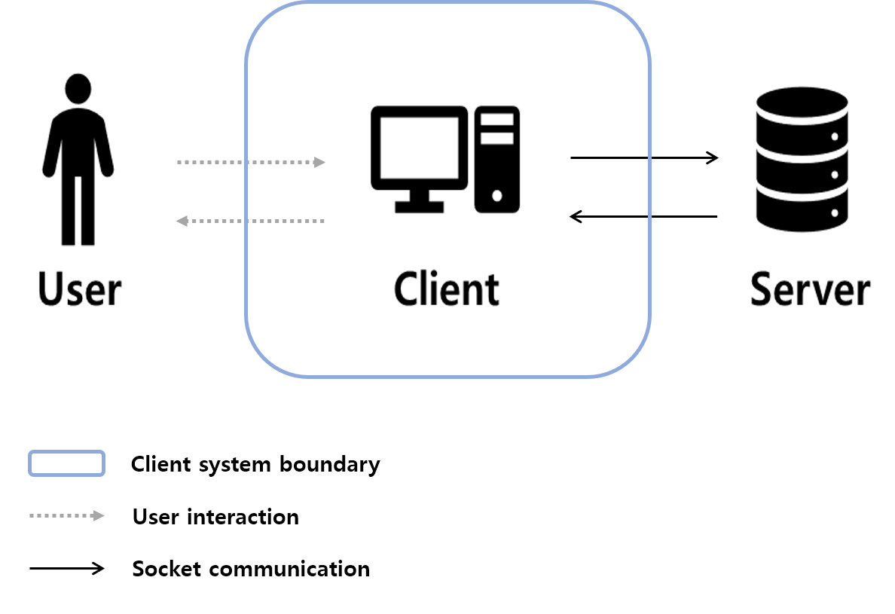

## 1. 서론 (Introduction)

### 1.1 목적 (Purpose)
-   본 문서의 목적은 미디어 컨텐츠 재생과 이를 사용하면서 발생하는 사용자 로그 및 미디어 데이터를 추출하고 서버로 전송하는 클라이언트 프로그램의 요구사항을 기술하는 것이다. 

### 1.2 범위 (Scope)
이 문서에는 아래의 요구 사항이 포함되어 있다.
-   로컬에 저장되어 있는 미디어 컨텐츠를 재생합니다.
-   미디어 재생과정에서 사용자 로그 및 미디어 데이터를 추출하고 서버로 전송합니다.

### 1.3 용어 및 약어 정리 (Definitions and Abbreviations)
-   Codec (Coder & Decoder) : 음성 또는 영상의 신호를 디지털 신호로 변환하는 코더와 그 반대로 변환시켜 주는 디코더를 통틀어 부르는 용어이다.
-   GUI (Graphic User Interface) : 사용자가 편리하게 사용할 수 있도록 입출력 등의 기능을 알기 쉬운 아이콘 따위의 그래픽으로 나타내서 사용자와 컴퓨터가 상호 작용하는 방식이다. 
-   CLI (Command Line Interface) : 텍스트 터미널을 통해 사용자와 컴퓨터가 상호 작용하는 방식이다.
-   UI (User Interface) : 사용자와 사물 또는 시스템, 컴퓨터 프로그램 등 사이에서 의사소통을 할 수 있도록 일시적 또는 영구적인 접근을 목적으로 만들어진 물리적, 가상적 매개체를 뜻한다. 
-   POSIX (Portable Operating System Interface) : 서로 다른 UNIX OS의 공통 API를 정리하여 이식성이 높은 유닉스 응용 프로그램을 개발하기 위한 목적으로 IEEE가 책정한 애플리케이션 인터페이스 규격이다.
-   API (Application Programming Interface) : 응용 프로그램에서 사용할 수 있도록, 운영 체제나 프로그래밍 언어가 제공하는 기능을 제어할 수 있게 만든 인터페이스를 뜻한다.

### 1.4 참고 문헌 (Reference)
-  https://gstreamer.freedesktop.org/

## 2. 종합기술 (Overall Description)

### 2.1 시스템 인터페이스 (System Interface)
-   시스템은 리눅스 환경에서 실행되며, 기본적인 사용자 등록 및 미디어 재생 요청은 CLI로 입력받는다. 미디어 재생 환경에서는 Video를 시청할 수 있도록, 새로운 화면을 띄우고 GUI를 지원한다.

### 2.1 시스템 컨텍스트 (System Context)

**User**

클라이언트 프로그램을 사용하는 사용자를 의미한다. 사용자는 클라이언트 프로그램에서 제공하는 인터페이스를 통해 지원하는 기능을 사용할 수 있다.

**Client**

 클라이언트 프로그램의 주 기능은 사용자 별 미디어의 이어보기 기능을 지원하는 것이다. 이어보기 기능을 위해 이전에 재생한 미디어 기록 정보를 요청하거나 재생한 미디어 기록 정보를 갱신하기 위해 서버와 소켓을 통해 상호작용한다. 

**Server**

클라이언트 프로그램에서 요청하는 정보를 제공하기 위한 서버이다. 사용자 정보와 미디어 정보를 데이터베이스에 저장하여 관리하는 주체이다.

_사용자 정보 : ID, Name, Age, Sex_

_미디어 정보 : file name, file size_

_사용자 별 미디어 정보 : last play time_

### 2.2 사용자 인터페이스

-   사용자들의 편리성을 중심으로 재생, 일시정지, 중지 등의 기능을 사용할 수 있도록 UI를 구성하도록 한다.

## 3. 상세 요구사항 (Specific Requirements)

### 3.1 기능 요구사항 (Functional Requirements)
#### 3.1.1 로그인 이전 상태
1. `FR01`: 아이디 발급
   -   `FR01-1`
       -   사용자로부터 아이디 발급 요청을 받으면 사용자 정보를 입력받고, 사용할 수 있는 사용자 ID를 발급한다.

2. `FR02`: 로그인
   -  `FR02-1`
      -  사용자로부터 로그인 요청을 받으면 사용자 ID를 입력받고, 서버의 데이터베이스에 등록되었는지 여부를 확인해 등록되어 있다면 로그인을 수행한다.

#### 3.1.2 로그인 이후
3. `FR03`: 미디어 재생
   -  `FR03-1`
      -  사용자로부터 미디어 재생 요청을 받으면 재생을 원하는 미디어 파일을 입력받고, 재생 가능한 파일인지 확인한다.
   -  `FR03-2`
      -  사용자가 선택한 미디어에 대해 이전에 재생한 기록이 있으면 해당 위치부터 재생을 시작한다.  
   -  `FR03-3`: 미디어 재생 과정에서 재생/일시 정지 기능을 지원한다.

4. `FR04`: 사용자 정보 출력  
   -  `FR04-1`: 사용자로부터 사용자 정보 출력 요청을 받으면 사용자가 현재 로그인한 아이디 발급을 위해 입력한 사용자 정보를 출력한다.

5. `FR05`: 최근 재생 목록 출력
   -  `FR05-1`: 사용자로부터 최근 재생 목록 출력 요청을 받으면 사용자의 최근 재생 목록을 출력한다.

6. `FR06`: 인기 재생 목록 출력
   -  `FR06-1`: 사용자로부터 인기 재생 목록 출력 요청을 받으면 서버에 저장된 재생 목록들에서 인기 재생 목록을 출력한다. 이 때, 남성, 여성, 전체에 대해서 선택을 통해 출력을 하게 한다.

7. `FR07`: 미디어 정보 출력
   -  `FR07-1`: 사용자로부터 정보를 출력하기 원하는 미디어 파일을 입력받고, 미디어 파일이 맞다면 미디어 정보를 출력한다.

8. `FR07`: 로그아웃
   -  `FR07-1`: 로그아웃 요청을 받으면 로그인 이전 상태로 돌아간다. 

### 3.2 품질 속성 (Quality Attribute)

1. `QA01`: 사용자가 이전에 재생한 기록이 있는 미디어를 다시 재생시킬 경우, 미디어 재생 기록 오차를 0.01초 이내로 제공하여 정확한 위치에서 미디어를 재생시킬 수 있다.(정확성)
   -  rationale 
      -  https://gstreamer.freedesktop.org/documentation/tutorials/basic/time-management.html?gi-language=c
      -  
      -  gint64 자료형을 사용하여 재생 위치별 시간을 출력하는 예제를 수행해본 결과 0.000001초 단위의 변경을 확인하였다.  
2. `QA02`: 사용자가 미디어를 재생함에 있어 재생 상태(재생/일시정지)를 1 스텝으로 변경할 수 있도록 제공한다.(사용편의성)
   -  rationale
      -  GStreamer에서 GUI 툴킷 중 하나인 GTK+를 사용한다.
      -  [사용자 인터페이스](#22-사용자-인터페이스) 에 보이는 것과 같이 버튼을 클릭하는 것으로 재생 상태를 제어할 수 있다.
