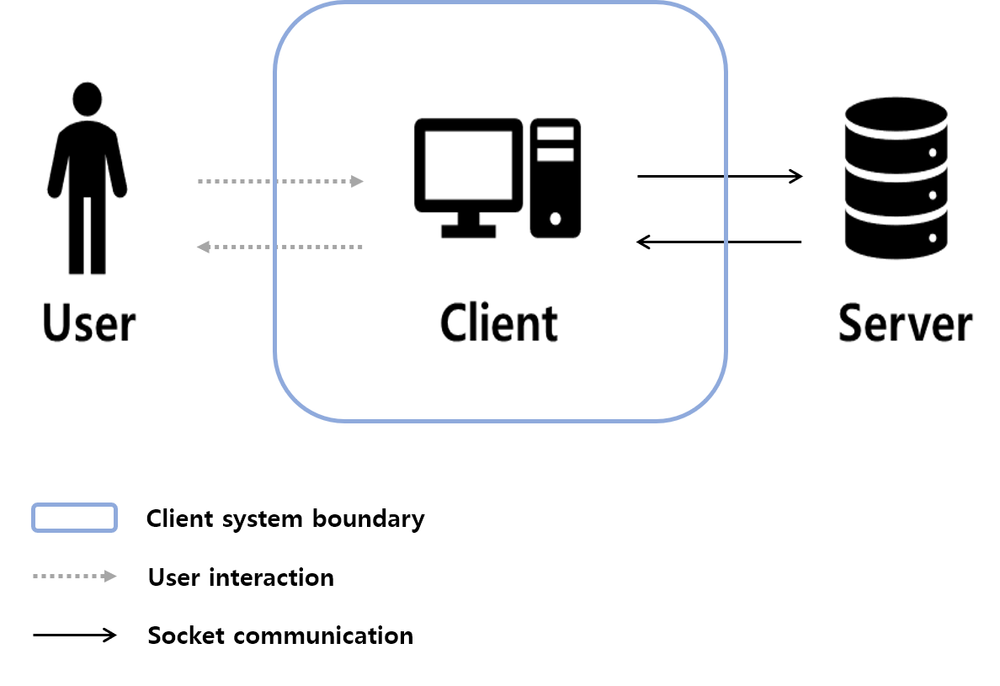
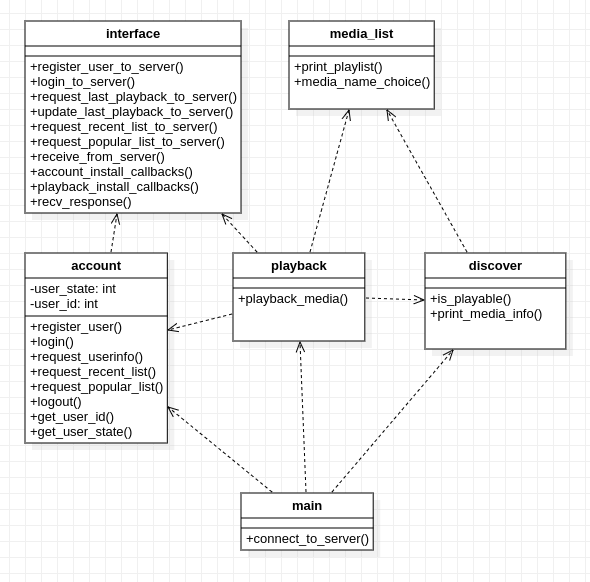
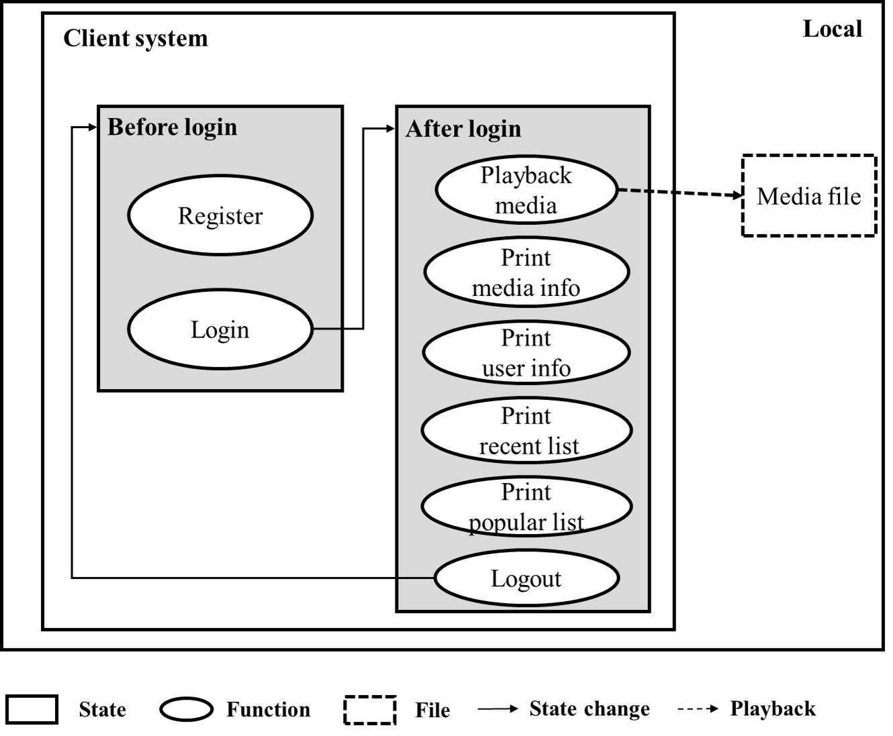
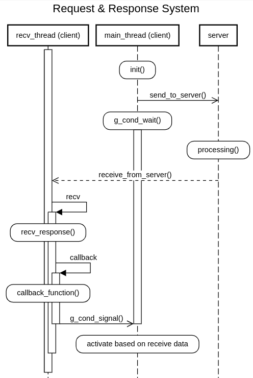
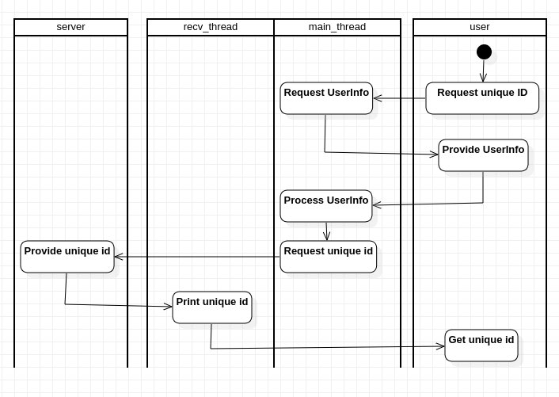
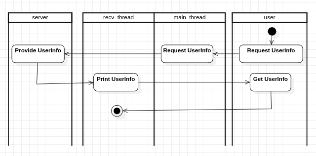
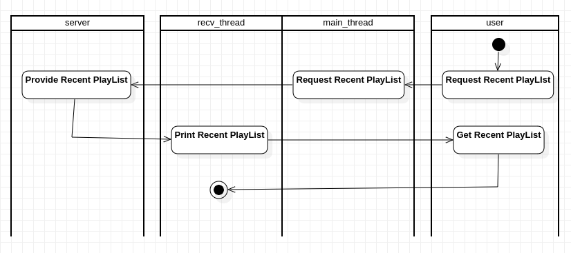
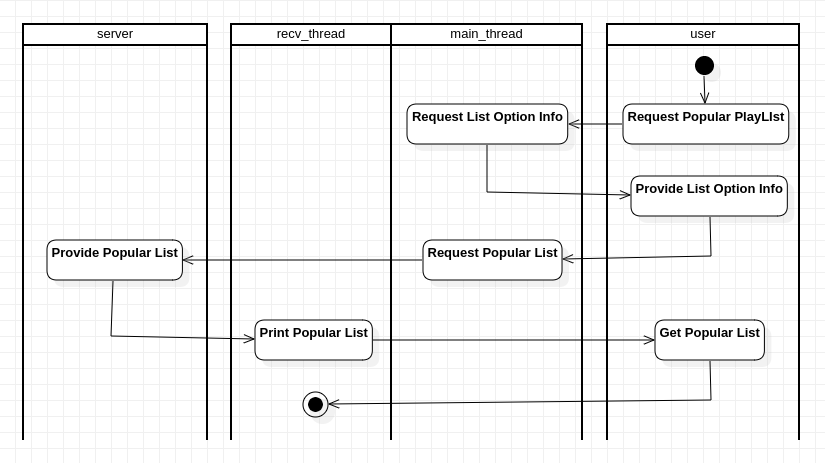
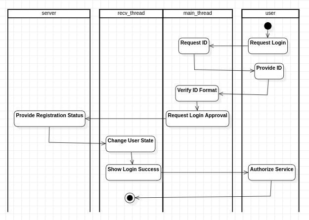
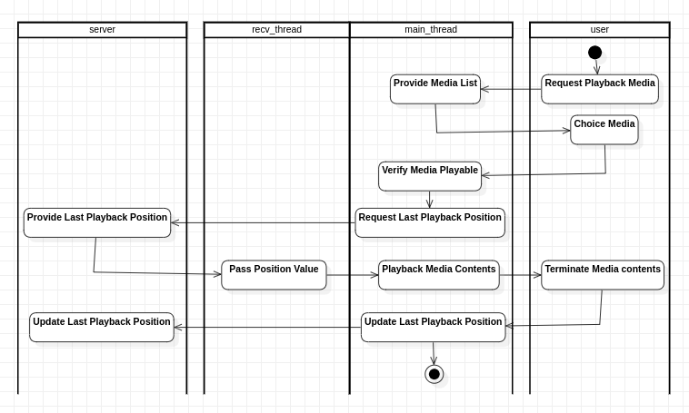

## 목차

- [목차](#목차)
- [1. System Context](#1-system-context)
- [2. Static Perspective](#2-static-perspective)
- [3. Dynamic Perspective](#3-dynamic-perspective)
  - [3.1 State Diagram](#31-state-diagram)
  - [3.2 Sequence Diagram](#32-sequence-diagram)
  - [3.3 Module](#33-module)

## 1. System Context

**User**

클라이언트 프로그램을 사용하는 사용자를 의미한다. 사용자는 클라이언트 프로그램에서 제공하는 인터페이스를 통해 지원하는 기능을 사용할 수 있다.

**Client**

 클라이언트 프로그램의 주 기능은 사용자 별 미디어의 이어보기 기능을 지원하는 것이다. 이어보기 기능을 위해 이전에 재생한 미디어 기록 정보를 요청하거나 재생한 미디어 기록 정보를 갱신하기 위해 서버와 소켓을 통해 상호작용한다. 

**Server**

클라이언트 프로그램에서 요청하는 정보를 제공하기 위한 서버이다. 사용자 정보와 미디어 정보를 데이터베이스에 저장하여 관리하는 주체이다.

_사용자 정보 : ID, Name, Age, Sex_

_미디어 정보 : file name, file size_

_사용자 별 미디어 정보 : last play time_

## 2. Static Perspective

**interface**

-   _to_server(): account, playback에서 서버로 데이터를 전송하기 위한 함수이다. account, playback에서 받은 정보를 인터페이스 규격에 맞는 구조로 합쳐서 전송하게 된다.
-   receive_from_server(): 별도의 수신 쓰레드로 동작한다. 데이터가 수신이 되면 recv_response를 호출한다.
-   recv_response(): 인자로 들어온 버퍼에서 cmd값에 따라 account, playback의 콜백함수를 호출한다.
- install_callbacks(): account, playback에서 callback 함수를 등록하기 위한 함수이다.

**media_list**

-   print_playlist(): 로컬에 존재하는 특정 위치의 파일 목록을 출력한다.
-   meida_name_choice(): 파일 목록을 출력하고, 출력된 파일 목록에서 번호를 입력받아 파일경로/파일이름을 반환한다.

**account**

-   register_user(): 사용자 정보를 입력하고, 서버로부터 ID를 발급받는다.
-   login(): ID를 입력하고, 로그인 성공여부를 수신한다. 승인되면 로그인 후 상태로 변경된다.
-   request_userinfo(): 서버로 사용자 정보를 요청한다. 
-   request_recent_list(): 서버로 사용자의 최근 재생 목록을 요청한다.
-   request_popular_list(): 서버로 인기 미디어 목록을 요청한다.
-   logout(): 로그아웃 상태로 변경한다.
-   get_user_state(): main에서 로그인 이전, 로그인 이후 상태를 판단하기 위해 user_state를 반환하는 함수이다.
-  get_user_id(): 로그인 이후에 playback에서 서버에 사용자에 따른 정보를 요청하기 위해 id를 필요로하는 경우에 user_id를 반환하는 함수이다.

**playback**

-   playback_media(): 서버로부터 재생을 원하는 미디어의 이전 기록을 받아와 해당 위치에서 미디어를 재생한다. 재생이 끝나면 최종 재생위치를 서버로 전송해 갱신을 요청한다.
-   재생창에서 GUI를 통해 재생상태를 제어할 수 있다.

**discover**

-   is_playable(): 파일이 재생가능한 미디어인지 확인한다.
-   print_media_info(): 해당 미디어의 정보를 출력한다.

**main**

-   connect_to_server(): 서버와 소켓통신으로 연결하기 위한 함수이다. 연결된 소켓의 파일디스크립션을 반환한다.

## 3. Dynamic Perspective

### 3.1 State Diagram

-   로그인 이전 상태에서 **Login** 을 통해 로그인 이후 상태로 변경할 수 있다. 이 때, 서버에서 **Login** 에서 입력받은 id값이 등록되어 있어야 로그인 상태로 변경될 수 있다. 등록되지 않은 id인 경우 로그인에 실패한다.
-   로그인 이후 상태에서는 **Logout**을 통해 로그인 이전 상태가 된다.

### 3.2 Sequence Diagram

사용자의 요청에 따라 서버와 통신을 필요로하는 경우 수행되는 동작이다. 
-   main_thread는 가장먼저 콜백함수를 등록하는 **init**을 수행한다.
-   main_thread에서 **send_to_server**를 통해 server에 필요한 정보를 요청하고, **g_cond_wait**을 통해 콜백함수에서 풀어주기를 기다린다.
-   **receive_from_server**를 통해 recv_thread가 server로부터 오는 데이터를  수신하고, **recv_response**를 호출한다.
-   **recv_response**는 수신한 데이터를 파싱하고, 필요한 정보를 콜백함수에 전달한다.
-   **callback_function**은 모듈 별 해야할 동작을 수행하고 **g_cond_signal**을 통해 main_thread에 걸려있던 **g_cond_wait**을 해제한다.
-   recv_thread는 다시 server로부터 오는 데이터 수신을 기다리고, main_thread는 이후 동작을 수행한다.

### 3.3 Module

본 문서에서 모듈은 사용자에게 제공되는 기능을 수행하는 단위를 의미한다. 해당 문서에서는 총 8개의 모듈을 포함한다. 이는 [3.1 State Diagram](#31-state-diagram) 의 function과 일대일 대응된다. 
모든 기능은 사용자의 요청으로부터 시작한다.

1. Register
-  사용자 정보를 입력받아 서버로부터 ID를 발급받는 기능
-  사용자 정보의 포맷을 검증하고, 서버로 요청한다.
-  서버로부터 수신한 정보는 recv_thread에서 수행되는 callback 함수에서 사용자에게 출력한다.

2. Print userinfo
-  서버에 저장된 사용자의 정보를 요청 및 수신하고, 출력하는 기능
-  서버로부터 수신한 정보는 recv_thread에서 수행되는 callback 함수에서 사용자에게 출력한다.  

3. Print recent list
-  서버에 저장된 사용자의 최근 재생 목록을 요청 및 수신하고, 출력하는 기능
-  서버로부터 수신한 정보는 recv_thread에서 수행되는 callback 함수에서 사용자에게 출력한다.  

4. Print popular list
-  서버에 저장된 모든 사용자의 데이터를 바탕으로 산출한 인기 목록을 요청 및 수신하고, 출력하는 기능
-  성별을 옵션으로 입력받아 인기 목록을 요청한다.
-  서버로부터 수신한 정보는 recv_thread에서 수행되는 callback 함수에서 사용자에게 출력한다.  

5. Login
-  ID를 입력받아 서버에 등록되어 있는 ID인 경우 로그인 이후 상태로 변경하는 기능
-  ID가 양의 정수인지 검증하고, 서버로 요청한다. 

6. Playback media
-  재생을 원하는 미디어 이름을 입력받고, 미디어를 재생하는 기능
-  미디어가 재생가능한지 확인 후, 서버로 마지막 재생 위치를 요청한다.
-  미디어가 종료될 시, 서버로 마지막 재생 위치 갱신을 요청한다.

7. Print media info
-  원하는 미디어의 메타데이터를 출력하는 기능
-  서버와의 통신을 필요로하지 않으므로 main_thread에서만 사용자와 상호작용한다.

8. Logout
-  로그인 이후 상태에서 로그인 이전 상태로 변경한다.
